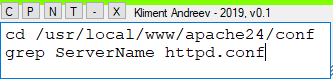

# cmddepot

cmddepot is a small .NET utility that allows you to quickly copy & paste frequently used commands.
For example, you are working in a terminal and you have to repeat certain commands. 
While you can use **!history** command and then execute the command with **!<cmd_no>**, for me it's much easier
to copy & paste that command into the terminal.

## Usage

Type or paste a command in the **cmddepot** window. You can paste the content of the clipboard if you click on the **P** button. Anytime you need to use these commands, just click on **C** button and paste wherever you need.

* **C** - Copy the content of the text window into the clipboard
* **P** - Paste the content of the clipboard into the text window
* **N** - Opens up a new instance of cmddepot. You can have unlimited instances running at the same time.
* **T** - Stay on top. **cmddepot** will be on top of the other windows.
* **_** - Minimize the instance on the task bar.
* **X** - Exits the program.

* If you want to move the **cmddepot** window, drag and drop from the green bar on top. 
* If you want to resize the **cmddepot** window, drag and drop from the bottom right corner. 

## Download

You can compile the program with Visual Studio and .NET 4.5 or get the binary from the releases section.